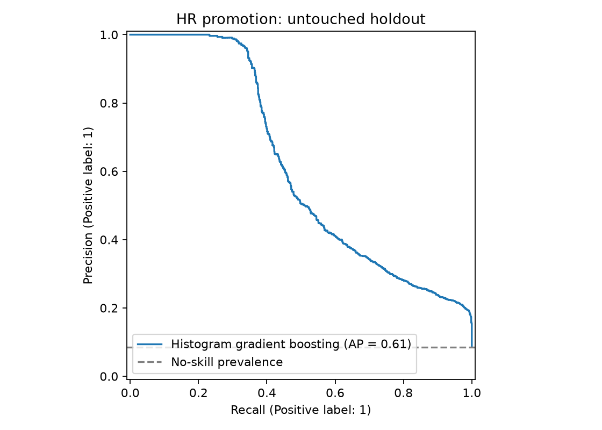
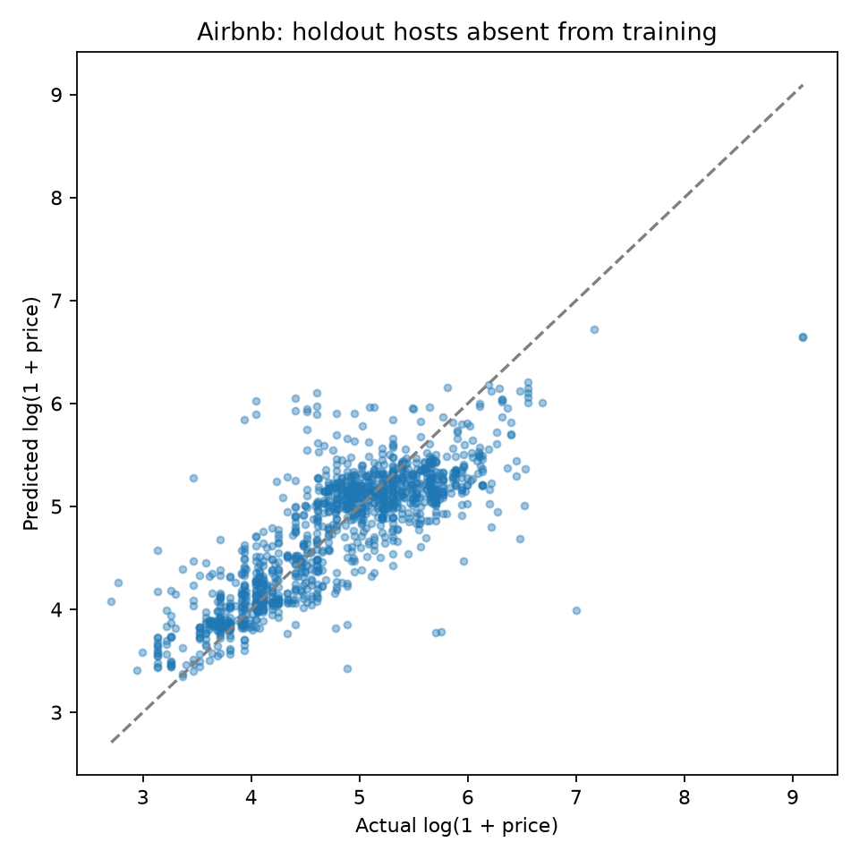

# Employee Promotion and Singapore Airbnb Price Prediction

Two machine-learning case studies by **Kelvin Beh**, developed for Ngee Ann
Polytechnic's October 2023 semester, with Assignment 2 submitted in the 2023–2024
academic period. The project explores employee promotion classification and
Singapore Airbnb listing-price regression through data exploration, feature
engineering and model comparison.

This repository includes the original coursework source and a **2026 evaluation
revision**. The revision corrects data leakage and regenerates results using
training-only preprocessing and held-out evaluation. The original headline
scores are superseded; see [the technical review](docs/REVIEW.md).

## Project at a glance

| Case study | Data and objective | Original work |
|---|---|---|
| HR analytics | 54,808 employees; predict `is_promoted` | Missing-value analysis, categorical encoding, composite performance features, class-imbalance experiments and eight classifier families |
| Airbnb pricing | 7,907 Singapore listings; original modelling scope of 6,309 Central Region listings | Geographic exploration, stay-rule transformations, location clusters, neighbourhood counts, nearest-MRT distance, five regressor families and a stacking experiment |

The original preparation notebook contains univariate, bivariate and multivariate
analysis using pandas, Matplotlib, Seaborn, Plotly and Folium. The modelling
notebook compares base models with grid or randomized hyperparameter searches
and records classification reports, regression errors and cross-validation scores.

## Work beyond the suggested model minimum

The supplied Assignment 2 brief encouraged at least two models for each problem,
tuning, evaluation and a reasoned recommendation. The notebooks explored:

- **Eight classifiers:** Random Forest, XGBoost, Extra Trees, Bagging, KNN,
  LightGBM, CatBoost and a multilayer perceptron.
- **Five standalone regressors:** Random Forest, Gradient Boosting, XGBoost,
  LightGBM and CatBoost, plus an RF/XGBoost stacking experiment with a linear
  regression meta-model.
- **HR feature engineering:** a performance sum combining prior rating, KPI
  achievement and awards; training score per training session.
- **Geographic features:** K-means location clusters and nearest-station distance
  using 171 supplied MRT station coordinates.
- **Reusable evaluation functions**, model comparisons and a written report.

These are evidenced implementations and experiments, not proof that every choice
improved performance. The Assignment 1 brief was not supplied, so its exact
requirements cannot be distinguished from extensions. A Streamlit application,
presentation slides and presentation recording were not in the supplied folder;
no deployment is claimed here.

## Verified results from the 2026 revision

Models and hyperparameters were selected using **training cross-validation**.
Only the selected model and a dummy baseline were then evaluated on each holdout.
These results are not directly comparable with the old scores: the code, splits,
features and evaluation protocol changed.

### Employee promotion

The winner among the revised candidates was histogram gradient boosting, selected
by average precision in three-fold stratified CV. The seeded 75/25 split contains
41,106 training and 13,702 test employees, with no employee-ID overlap.

| Holdout metric | Selected model | Majority/prior baseline |
|---|---:|---:|
| Average precision | 0.612 | 0.085 |
| ROC AUC | 0.909 | 0.500 |
| Accuracy | 94.26% | 91.48% |
| Balanced accuracy | 66.98% | 50.00% |
| Promotion precision | 95.90% | 0.00% |
| Promotion recall | 34.10% | 0.00% |
| Promotion F1 | 0.503 | 0.000 |

Only **8.52%** of employees are promoted. Accuracy therefore needs the baseline
and minority-class metrics above. At the fixed 0.5 threshold, the selected model
detects 398 of 1,167 promoted test employees and misses 769. Its high precision
comes with low recall. No threshold optimization, fairness validation or production
readiness is claimed.



### Airbnb price prediction

The revised dataset contains **6,308 positive-priced Central Region listings**;
one zero-price listing is excluded. Splits are by host: 5,009 training listings
from 1,400 hosts and 1,299 test listings from 350 different hosts. No host crosses
the training/test or CV boundaries.

Group-aware stacking was selected by three-fold grouped CV, with mean log-price
RMSE **0.508**, compared with **0.511** for histogram gradient boosting. That small
difference is not evidence of statistically significant superiority. The revised
stack combines Random Forest and histogram gradient boosting with a ridge
meta-model trained on group-disjoint out-of-fold predictions.

| Holdout metric | Selected stack | Constant mean-log-price baseline |
|---|---:|---:|
| RMSE on `log1p(price)` | 0.450 | 0.794 |
| R² on `log1p(price)` | 0.674 | -0.010 |
| MAE in original price units | 67.64 | 103.39 |
| RMSE in original price units | 332.62 | 368.18 |
| R² in original price units | 0.173 | -0.013 |

The large difference between log-scale and original-scale results shows the
difficulty of extreme prices. R² is a variance-explanation measure, not a
percentage of correct predictions. Price currency was not verified from source
metadata, so errors are described as **dataset price units**.



Full CV scores, parameter choices, split sizes, package versions and input hashes
are in [results/metrics.json](results/metrics.json).

## What the revision fixes

The original HR code resampled the entire dataset with SMOTE after splitting;
the Airbnb stack fitted on test labels. Their reported 96.88% accuracy and 0.8804
R² are therefore withdrawn as generalization claims.

The corrected workflow starts from the raw CSVs. Imputation, categorical encoding,
scaling, clustering and other learned feature statistics are fitted inside each
training fold. It excludes target-derived predictors, handles nominal categories
with one-hot encoding, includes simple baselines, uses deterministic seeds and
checks stacking and split integrity. HR class weighting is compared inside CV
instead of applying SMOTE to encoded categories.

The smaller revised benchmark uses three HR candidate families and four Airbnb
candidate families. It does not claim to reproduce every original search. The
original source is retained in `archive/` with prominent notices and stripped
outputs. The new code, tests and measurements are explicitly a later revision.

## Repository layout

```text
src/                         Corrected feature engineering and evaluation
tests/test_integrity.py       Tests for leakage boundaries and feature behaviour
notebooks/project_walkthrough.ipynb
                             Executed guide to the verified results
results/                     Metrics and two diagnostic figures
docs/REVIEW.md                Findings, fixes and remaining limitations
data/raw/README.md            Required inputs and data provenance status
archive/                     Original coursework source, clearly superseded
requirements.txt             Versions used for the current workflow
```

## Reproduce the current workflow

Tested with **Python 3.12.14**. From the repository root:

```bash
python -m venv .venv
# Windows PowerShell:
.venv\Scripts\Activate.ps1
# macOS/Linux: source .venv/bin/activate
python -m pip install -r requirements.txt
python -m unittest discover -s tests -v
python -m src.evaluate --data-dir "path/to/original/data" --output-dir results
```

The data directory must contain `hr_data.csv`, `listings.csv` and
`Cleaned_MRT_Stations.csv`. The default directory is `data/raw/`. Input files are
read without modification. Running evaluation replaces the aggregate metrics and
figures in the chosen output directory. Training uses bounded three-fold searches
and at most two estimator threads; runtime depends on hardware.

Open the walkthrough in a Jupyter-capable editor, such as VS Code with the Jupyter
extension, and choose this virtual environment. It displays saved results without
needing the datasets. Its optional training switch is off by default.

**Data availability:** datasets are not bundled because their original sources,
versions and redistribution terms are unverified. A fresh clone can run the
integrity tests and inspect the saved results, but needs the inputs to retrain.
See [data provenance](data/raw/README.md). No license grant for third-party data
or school materials is implied.

## Limits and next improvements

This is a retrospective educational project. It has no external or temporal
validation. The HR study has no fairness or calibration audit, and excluding
gender or age does not establish an unbiased model. Airbnb findings are limited
to historical Central Region data and unseen-host evaluation. The MRT snapshot
date is unknown; distances are straight-line approximations, not walking time.

Useful next experiments would choose HR thresholds using training-only validation,
examine subgroup performance and calibration, establish dated dataset sources,
and test Airbnb models on later data. Deployment should follow those checks rather
than being inferred from notebook scores.
